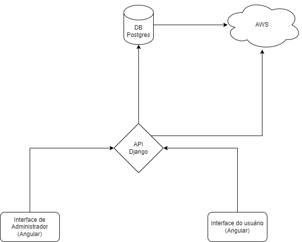

# QRCidadão

## Descrição

Um projeto para contribuir com a transparência do uso de recursos públicos e privado, além de contribuir com o processo de gestão de feedbacks, sugestões e denúncias.

## Design de Projeto

## Tecnologias

- Frontend:
  - Angular
- Backend:
  - Python Django Rest Framework
- Database:
  - PostgreSQL
- Queue:
  - RabbitMQ
- Deployment:
  - Docker
  - AWS

## Requisitos

- Painel de administração
  - Cadastrar veículo/máquina/estabelecimento
  - Detalhamento de veículo/máquina/estabelecimento
    - Nome
    - Marca
    - Categoria
    - Órgão
    - Descrição
      - Complemento
  - Gerenciamento de denúncias e feedbacks:
    - Detalhamento de denúncia
      - Descrição
      - Data
      - Órgão
      - Categoria
      - Status
        - Pendente
        - Em análise
        - Concluído
        - Cancelado
        - Não tem categoria
  - Emissão de Relatórios
    - Relatório de denúncias
    - Relatório de feedbacks
    - Notificação de denúncias

---

# Projetos

### Dashboard de Administração

#### Descrição

Uma aplicação frontend de dashboard que permitirá o monitoramento e gerenciamento dos bens da instituição, bem como das denúncias e feedbacks recebidos.

---

### Dashboard do usuário/cidadão/cliente

#### Descrição

Uma aplicação frontend que permitirá o envio de forma rápida, prática e intuitiva de denúncias e feedbacksa a respeito dos bens e serviços da instituição.

---

### API de Gestão de Feedbacks

#### Descrição

API responsável por tratar da gestão de bens e feedbacks relacionados ao painel de administração bem como do painel do cliente para o envio de feedbacks.

---
