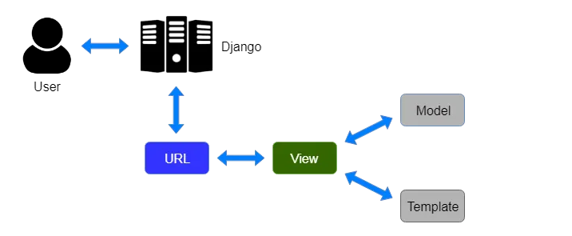

# QR Cidadão Conectado API

## Descrição/Description

Este é um sistema desenvolvido com Django e Django REST Framework para a gestão de veículos públicos e denúncias de irregularidades.

This is a system developed with Django and Django REST Framework for managing public vehicles and reporting irregularities.


## Funcionalidades/Features:
- Leitura de QR Codes para acesso a informações específicas de veículos.
- Criação de denúncias de irregularidades com preenchimento automatizado de data.
- Controle de acesso baseado em token:
    - Usuários não autenticados: leitura de dados de veículos e criação de denúncias.
    - Superusuários: gerenciamento completo de veículos e denúncias.
      

## Design

1. Model:
2. View:
3. Template:
4. Presentation:




## Instalação/Installation

1. Clone o projeto/Clone the project:

```bash
  git clone https://github.com/mancinilucas/dj-qrcc-api.git
```

2. Entre no diretório do projeto clonado/Enter the cloned project directory:
```
 cd dj-qrcc-api/api-qrcidadao
```

3. Crie um ambiente virtual/Create a virtual env:
```
  python -m venv venv
```

4. Ative o ambiente virtual/Activate the virtual env:

- Windows:
```
  venv\Scripts\Activate.ps1
```

- Linux:
```
  source venv/bin/activate
```

5. Instale as dependências listadas no arquivo requirements.txt/Install the dependencies listed in the requirements.txt file:
```
  pip install -r requirements.txt
```

6. Se necessário aplique as migrations/If necessary, apply migrations:
```
  python manage.py migrate
```

7. Para iniciar o servidor local, use o comando/To start the local server, use the command:
```
  python manage.py runserver
```

8. Credenciais para testes/Testing credentials:
8.1 Criar super usuário/Create superuser
```
  python manage.py createsuperuser
```
8.2 Gerar token/Generate token
```
  api/token/
```


## Documentação da API / API documentation

#### Api Root

```
  GET /
```

#### Documentação OpenAPI / OpenAPI Doc

```
  GET /api/docs/
```
### Tecnologias e Dependências/Prerequisites

- Python 3.12.4
- Django 5.1.1
- Django Rest Framework 3.15.2
- Django Rest Framework SimpleJWT 5.3.1
- PyJWT 2.10.1
- Django-Cors-Headers 4.6.0
- Django-Filter 24.3
- DRF-Spectacular 0.28.0
